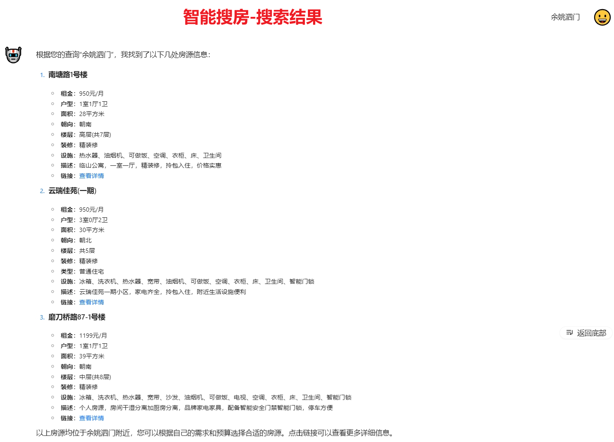
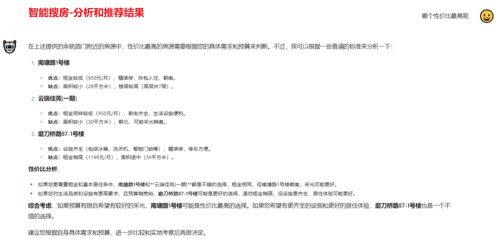
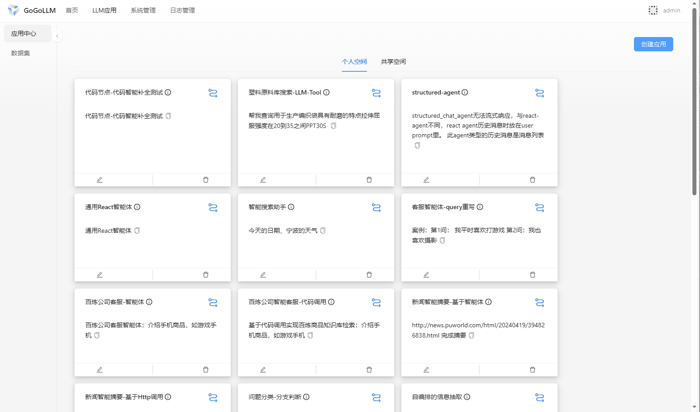
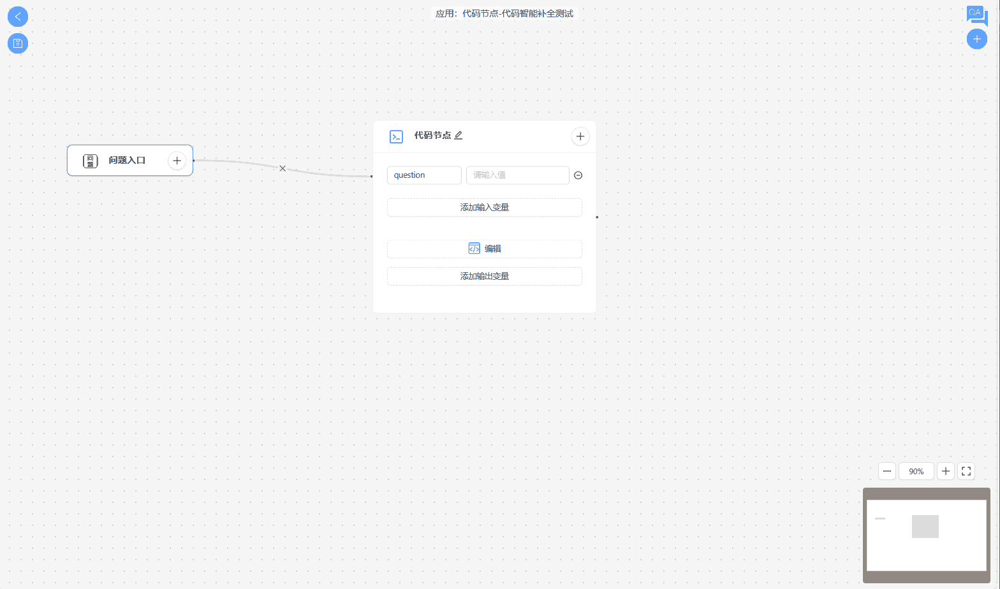

# 简介

让我们在不到5分钟的时间内了解 GoGoLLM。

## GoGoLLM是什么
GoGoLLM是开发者优先的面向企业级LLM应用研发平台, 专注于提升企业级LLM应用的开发效率，以减少研发周期，快速重构产品，
让产品创新&提升体验不再遥远，产品智能化触手可及。   

## GoGoLLM快速预览

## 更多Demo演示

### 1. 智能语义化搜索
企业级垂直领域智能搜索是本开源项目的重心

### 1.1 
> 此demo是智能租房搜索场景，智能搜索、多维度分析推荐房源。

### 1.2
> 此demo基于企业内部业务场景，智能搜索塑料原料产品。

### 2. 角色扮演对话——苏苏

### 3. 结构化信息抽取——json格式

### 4. 问题分类-分支节点
> 根据用户问题使用大模型进行问题分类，之后根据大模型分类结果动态路由到不同角色的大模型来回答问题。

### 5. 百炼公司智能客服
> 基于代码调用实现百炼手机商品知识库检索，知识库检索功能基于阿里云百炼平台实现。

### 6. 百炼公司客服智能体-query重写编排
> 使用大模型将用户原问题进行重写。
> 
> 原问题：我平时喜欢打游戏; 
> 
> 重写后的问题：请推荐一款适合打游戏的手机，注重性能、散热和屏幕刷新率。
> 
> 重写后的问题能够提高检索召回率，使得检索结果更加符合用户意图。

### 7. 基于http调用JinaAI Reader实现网页新闻智能摘要

### 8. 智能搜索助手-工具调用

### 9. 代码节点-代码智能补全
> 实现了代码节点编码补全功能。

如有相关咨询可添加下方微信：

tushengtao1014

